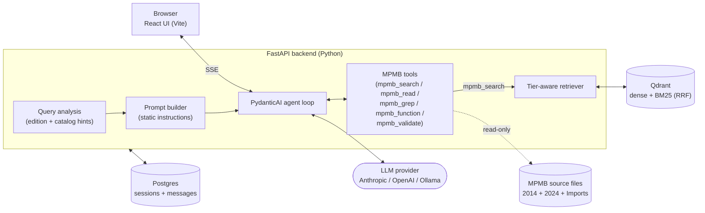

# MPMB-Copilot

> **AI assistant that helps you write MPMB JS scripts using the actual MPMB source code and examples as ground truth.**
> ⚠️ **Pre-release.** This is a working prototype, not a polished product. Setup involves several moving parts (Docker, an LLM API key, indexing) and the UX still has rough edges. If you're a D&D player who just wants AI help writing MPMB scripts, expect a bumpy ride for now — feedback welcome.

## NOTES

There are currently some outstanding items I need to implement. I want this be more agentic insted of the normal RAG workflow; i.e. Ask question -> Embed & Query -> Returns top K results -> LLM processes that -> Generate Response -> Returns back to you. I see several issues with this, mainly efficiency and wastefulness. Broad questions tend to return large results, and we're relying on semantic meanings rather than intent. That's why I gave this LLM tools so that it can decide for itself whether or not the results from the Query store are insufficient and use those tools to gather the information it actually needs. Some major breaking changes will be coming soon, mainly in the form of agentic development. Instead of embedding and querying every question against the store, your question will go straight to the LLM and it'll have a query tool where it can query the store as it needs to. See below for future plans and TODO's.

I have not tested this with OpenAI since I started this project. Testing has been exclusively with Anthropic since that my model of choice. Please keep this in mind that as of 5/03/2025, everything is working as intended with Anthropic. If you encounter issues with other providers please let me know.

Also, I'm a native english speaker and it's my only language. All of the existing intent examples under `./data/intent_examples.json` is produced by AI. If any of these examples should be written differently, please open an issue. If you also don't mind adding a brief explanation for me to learn, please add that too :\).

I also hope that this makes it easier for people wanting to migrate scripts from 2014 -> 2024 (and vice versa? not sure why you'd want that).
This should be a tool meant to help aid creation of scripts but also ensure backwards compat with older sheet versions.

Building this, I realized that I need to also implement more of a standard for code quality. Here's my findings so far (expanding...):

- [ ] Prefer desc([]) function over raw `description` attribute strings

## TODO's

Most of these have now shipped. See [What's next](#whats-next) for the live roadmap.

- ✅ **Eliminate pre-retrieval path** — questions go straight to the LLM; retrieval is no longer forced on every turn.
- ✅ **`mpmb_search` tool** (`query`, `edition`) — `top_k` was dropped in favor of intent-based tier budgets, but the LLM still decides when to search
    - This trusts the LLM will make the right call on when to search
- ✅ **Prompt caching using Anthropic break points** — verified live (turn 2 reads ~87% of its input tokens from cache)
    - Anthropic allows up to 4 break points on a query. We set one on the system prompt since that never changes, and then n-1 on the chat history so that a new question doesn't always invoke a new cache miss.
    - The cache window ~5 minutes, but on a cache hit, you'll only consume ~%10 of the cost you'd normally would if you didn't use caching.
    - This does not seem like a lot, but may I remind you, that your entire chat history will be sent to the LLM so it is compounding and an exponential savings on money when this is enabled.
        - Why send the entire chat history to the LLM? This is how most chat agents currently work. This is no different especially the fact that I have allowed people to pick their poison of choice. If you switch from Anthropic to OpenAI, it's a simple configuration change and it just works as intended.
- ✅ **Per-provider cheap model configuration** — used for title generation today, routing later
- ✅ **Per-tool pill text on the frontend** — the streaming pill now names the tool the LLM is using
- ✅ **Editable titles** — in-sidebar rename shipped; auto-titles defer once you rename a chat
- ✅ **Provider-driven model + effort selection** — Settings has dynamic model and reasoning-effort dropdowns sourced from the backend, no hardcoded lists
- ✅ **Embedding-model identity** — the index records its provider/model/dimension and refuses mismatched queries
- ⬜ I have to add screen shots of it actually working. I'll do that after my in-depth analysis of the MPMB repo and source repo's.

<!-- TODO: add screenshot of chat UI showing a tool-use response with the "Used 2 tools" footer expanded -->

## What it does

MPMB-Copilot is a chat interface, like ChatGPT or Claude, but specialized for [MorePurpleMoreBetter's D&D 5e Character Record Sheet](https://github.com/morepurplemorebetter/MPMBs-Character-Record-Sheet). When you ask a question, your message goes straight to the model, which then:

1. Decides whether it even needs the MPMB source (a greeting or a general JavaScript question doesn't)
2. Calls `mpmb_search` to pull the most relevant code snippets, syntax templates, and examples from the indexed source (11,000+ chunks across the 2014 + 2024 editions plus the WotC Imports repo), with a local cross-encoder reranking the candidates so the best match sits at the top
3. Optionally follows up with `mpmb_read`, `mpmb_grep`, or `mpmb_function` to verify an exact signature or function body instead of guessing
4. Streams the answer back — through Claude (Anthropic), GPT (OpenAI), or a local Ollama model — citing the source files it used so you can copy-paste working code

This is a deliberate shift away from the older "retrieve on every turn" RAG flow: retrieval is now a tool the model invokes only when it decides it needs it, not a forced step on every message. You'll see a "🔍 Verifying code…" indicator while it works, and a "Used N tools" footer below the answer.

## Who this is for

- **Homebrew authors** who want to add a new race, subclass, spell, or magic item to MPMB and need help with the syntax
- **MPMB contributors** who maintain the source and want a fast way to look up obscure attributes or trace call sites
- **Curious tinkerers** who want to understand how MPMB works under the hood

You don't need to be a programmer, but you do need to be comfortable installing Docker and editing a config file once. After that, it's just a chat window.

## What you'll need

- **An LLM API key.** Anthropic Claude is the default and works best (the system prompt is tuned for it). OpenAI and Ollama also work. You pay the LLM provider directly for tokens — this project doesn't host anything.
- **Docker Desktop** (Windows/macOS) or Docker Engine (Linux) — for Postgres and the vector database.
- **Node.js 24+** and **Python 3.13+** — for running the chunker, the backend, and the web UI.
- **`pnpm`** — Node package manager (the repo is a pnpm workspace, pinned via `packageManager`). [Install instructions](https://pnpm.io/installation).
- **`uv`** — Python package manager. [Install instructions](https://docs.astral.sh/uv/getting-started/installation/).
- **About 5 GB of disk** for the chunked source files, vector index, and Docker images.

## Quick start

```bash
# 1. Clone this repo and the MPMB sources it indexes
git clone https://github.com/track507/MPMB-Copilot.git
cd MPMB-Copilot
pnpm install

# 2. Add your API key
cp .env.example .env
# edit .env, set ANTHROPIC_API_KEY (or OPENAI_API_KEY)

# 3. One-shot setup: clones MPMB sources, chunks them, starts Postgres+Qdrant, indexes
pnpm run setup:all

# 4. Run the dev servers (frontend + backend)
pnpm run dev
```

Open <http://localhost:5173/>. **On first visit you'll be asked to create an admin account** — the app is login-gated by default (cookie sessions, argon2id passwords). Then start chatting.

> **Auth and the index step:** the indexing API sits behind auth, so `setup:all`'s final index step needs a credential. Two options:
>
> - **Dev shortcut (local only):** set `AUTH_DISABLED=true` in `.env` before `setup:all`. It's honored only on a loopback bind — it can never disable auth on an exposed interface.
> - **Proper path:** run `setup:all` (the index step will tell you what it needs), create your admin account in the browser, mint a service key with `pnpm run mint-key`, put it in `.env` as `SERVICE_API_KEY`, then `pnpm run index`.

The first time you start the backend it will take ~30 seconds to load the embedding model. After that, responses stream in a few seconds.

## Updating the MPMB sources

MPMB ships updates frequently. To pull the latest source, re-analyze, re-chunk, and re-index:

```bash
pnpm run setup       # git pull on the source repos + re-run the chunker
pnpm run rechunk     # analyze + chunk + force re-index in one shot (backend must be running)
```

Or trigger a rebuild from the UI: Settings -> Vector Index -> enable **Force rebuild** -> Re-index (with a live progress bar). Either path needs auth: a `SERVICE_API_KEY` in `.env` for the scripts (mint one with `pnpm run mint-key`), or your admin login for the UI.

## How it's built



- **Frontend:** React 19 + Vite + TanStack Query + Zustand + shadcn/ui
- **Backend:** FastAPI + PydanticAI + SQLAlchemy + Alembic migrations
- **Vector store:** Qdrant (hybrid retrieval: dense embeddings via FastEmbed + BM25 sparse, fused with RRF, then reranked by a local cross-encoder)
- **Database:** Postgres (sessions, messages, users, auth sessions, API keys, answer feedback, uploaded-file registry)
- **LLM providers:** Anthropic, OpenAI, Ollama (configurable)
- **Auth:** cookie sessions with argon2id passwords; ops scripts authenticate with scoped, revocable API keys
- **Local inference:** ONNX Runtime on CPU by default, with an opt-in GPU mode (see [GPU acceleration](#gpu-acceleration))

## Repository layout

```
MPMB-Copilot/
├── backend/                  # FastAPI app — see backend/README.md
│   └── evals/                # retrieval eval harness (cases, matrix runner, feedback exporter)
├── frontend/                 # React app    — see frontend/README.md
├── data/                     # gitignored: cloned MPMB sources, chunks, index cache
├── docker/                   # Dockerfiles for backend + custom postgres image
├── docker-compose.yml        # postgres + qdrant + backend
├── docs/                     # policy docs
├── scripts/
│   ├── setup.ps1             # clone/pull MPMB source repos, run chunker
│   ├── chunk_mpmb.py         # chunk MPMB JS into JSON files for indexing
│   ├── analyze/              # AST source analyzer (feeds the chunker + prompt catalog)
│   ├── validate/             # ES5/AcroJS static validator (lints scripts without executing)
│   ├── index.mjs             # trigger /api/index against running backend
│   ├── mint-key.mjs          # mint a scoped service API key for the ops scripts
│   ├── service-key.mjs       # shared SERVICE_API_KEY lookup for the scripts
│   ├── check-port.mjs        # pre-flight check before uvicorn
│   └── wait-and-index.mjs    # used by setup:all — poll backend then index
├── package.json              # all dev commands
└── README.md                 # you are here
```

## Common commands

```bash
# First-time setup
pnpm run setup              # clone/update MPMB source repos + chunk
pnpm run setup:docker       # build & start postgres + qdrant + backend containers
pnpm run setup:index        # wait for backend health then index Qdrant
pnpm run setup:all          # all three above, in order

# Day-to-day
pnpm run dev                # frontend + backend in parallel (recommended)
pnpm run dev:backend        # backend only (FastAPI on :8000)
pnpm run dev:frontend       # frontend only (Vite on :5173)
pnpm run docker:up          # start postgres + qdrant
pnpm run docker:down        # stop containers

# Refreshing content
pnpm run analyze            # re-run the AST source analyzer
pnpm run chunk              # re-chunk after pulling MPMB sources
pnpm run index              # force re-index into Qdrant (drops + rebuilds)
pnpm run index:if-empty     # only index if Qdrant collection is empty
pnpm run rechunk            # analyze + chunk + index, in order

# Auth & hardware
pnpm run mint-key           # mint a scoped SERVICE_API_KEY (logs in with your admin account)
pnpm run gpu:install        # Linux + NVIDIA only: swap in the CUDA onnxruntime

# Quality gates
pnpm run check              # lint + format check + tests
pnpm run check:full         # also runs mypy + tsc
pnpm run validate:corpus    # static-validator gate: the engine corpora must lint clean
```

## Features

- ✅ **Agentic retrieval** — the model calls `mpmb_search` when it decides it needs source, instead of every question forcing an embed + query
- ✅ **Hybrid retrieval** — dense embeddings (BAAI/bge-small-en-v1.5) + BM25 sparse, RRF-fused for relevance even on rare identifier names
- ✅ **Tier-aware ranking** — authoritative sources (`_functions/`, `_variables/`, `additional content syntax/`) score above community examples
- ✅ **Edition-aware** — auto-detects whether your question is about 2014 or 2024 rules and filters accordingly
- ✅ **Tool use** — `mpmb_search` (indexed search), `mpmb_read` (exact file ranges), `mpmb_grep` (regex across source), `mpmb_function` (a named function/variable body), and `mpmb_validate` (static ES5/AcroJS script check)
- ✅ **Static script validation** — an ESLint-based ES5/AcroJS checker with analyzer-generated, edition-aware sheet globals; the agent validates every script it writes (`mpmb_validate`) and fixes findings before answering
- ✅ **Prompt caching** — Anthropic cache breakpoints on the system prompt, tool definitions, and chat history; later turns read most of their input from cache
- ✅ **Streaming** — Server-Sent Events stream tokens as they generate, with intermediate tool-use indicators
- ✅ **Session persistence** — every conversation is saved to Postgres, lives at its own `/chat/<id>` route, and resumes on refresh
- ✅ **File uploads** — attach files in the composer (`.js/.txt/.md/.yml/.yaml/.json/.pdf`, staged then uploaded on send with a progress bar) so the agent can read your own scripts and bundles; per-message attachment chips, plus a **Library** page for a personal (global) and an admin-managed shared collection. Uploads are scoped, content-hashed, and stored on disk with a Postgres registry as the source of truth (PDFs store today but aren't tool-readable yet — that's the next slice)
- ✅ **Auto-titled sessions** — the first message generates a 4-6 word title via a cheap per-provider model, and auto-titling steps aside once you rename a chat
- ✅ **Inline citations** — answers reference the source files (path + line range) the model pulled from via its tools
- ✅ **Model + effort picker** — Settings dropdowns list each provider's models and their supported reasoning-effort levels, fetched live from the backend (no hardcoded lists), with a Custom escape hatch and free-form Ollama input
- ✅ **Embedding-model identity** — the index is stamped with its embedding provider/model/dimension; on a mismatch the app refuses dense queries and reports "re-index required" instead of returning garbage similarities
- ✅ **Cross-encoder reranking (on by default)** — a local MiniLM-L6 reranker re-scores hybrid candidates before the cut; adopted after the built-in eval harness measured +0.14 MRR over fused order at ~1s/search (larger rerankers tied on quality at 10-25x the latency and were benched)
- ✅ **Login & accounts** — first-run admin setup, cookie sessions (opaque tokens, SHA-256 at rest), argon2id passwords, fail-safe exposure (a non-loopback bind with no admin requires a one-time logged setup token)
- ✅ **Scoped API keys** — mint revocable, scope-limited service keys for the ops scripts (`pnpm run mint-key`); keys authenticate only against the indexing endpoints and can never touch chats or settings
- ✅ **Answer feedback → eval loop** — thumbs up/down (with optional note) on every answer; the exporter turns up-votes into ready-made retrieval eval cases (the persisted search trace supplies the expected result) and down-votes into skeletons for curation
- ✅ **Eval harness** — `backend/evals/` scores retrieval (hit-rate + MRR) across named configs in one run and persists results stamped with the embedding identity, so every model/reranker swap is a measurement instead of a guess
- ✅ **Reindex UX** — a Force rebuild toggle with confirmation, live progress bar (attaches even to CLI-started runs), and honest no-op messages; the top-bar index dot reflects real state
- ✅ **Role-aware UI** — settings are admin-only end to end; non-admin users get a 404 on admin routes (no endpoint discoverability), and the backend enforces the same wall regardless
- ✅ **GPU acceleration (opt-in)** — route local embedding + reranking onto your GPU with one toggle; see [GPU acceleration](#gpu-acceleration)
- ✅ **Durable model cache** — local ONNX models live under `data/models/`, not the OS temp dir, so a Windows temp cleanup can't silently break retrieval

## Static validator

`scripts/validate` lints MPMB scripts without executing them: post-ES5 syntax (with teaching messages instead of opaque parse errors), AcroJS rules like `console.println`, and unknown or wrong-edition globals — the whitelist is generated from the AST analyzer's report, never hand-maintained.

- `pnpm run analyze` — regenerates the analysis report and the validator's edition-aware globals (`scripts/validate/globals.generated.json`)
- `pnpm run validate:corpus` — acceptance gate: both engine corpora must lint with zero errors (append `-- --extra <dir> <edition>` for extra trees)
- The backend exposes it to the agent as the `mpmb_validate` tool; a validator failure degrades to an error message in chat, never a stalled turn

## GPU acceleration

Local inference (the embedding model and the reranker) runs on **CPU by default** — safe everywhere, no drivers required. If you have a GPU, you can opt in from **Settings → Compute device → "Use GPU for local models"**. It's a preference, not a demand: cloud embedding providers ignore it, and a model that can't load on the GPU falls back to CPU on its own. The payoff is a much faster full re-index and lower per-search reranking latency.

| Platform | What it takes |
|---|---|
| **Windows** (AMD, NVIDIA, or Intel — any DX12 GPU) | Nothing — the DirectML runtime ships by default. Just enable the toggle. |
| **Linux + NVIDIA** | `pnpm run gpu:install`, restart the backend, enable the toggle (it will read "GPU (CUDA)"). |
| **Docker + NVIDIA** | Install [nvidia-container-toolkit](https://docs.nvidia.com/datacenter/cloud-native/container-toolkit/latest/install-guide.html), add `gpus: all` to the backend service in `docker-compose.yml`, and run `pnpm run gpu:install` inside the container (advanced; CPU is the supported default in Docker). |
| **AMD on Linux / macOS** | Not supported yet — the toggle shows "GPU support not installed" and everything runs on CPU. |

**Caveat (Linux):** a plain `uv sync` in `backend/` restores the CPU runtime — re-run `pnpm run gpu:install` afterward. A future add-on installer will make this a one-click install from the settings screen.

## What's next

The agentic-retrieval migration, auth + scoped API keys, the eval harness + feedback loop, cross-encoder reranking, GPU acceleration, file uploads, and the static script validator are all shipped. Ahead:

- **Write tools** — let the agent produce or apply diff patches for your own homebrew scripts (with explicit approval — never auto-applied)
- **PDF ingestion** — read filled MPMB sheet PDFs (AcroForm fields + embedded scripts) and diff them against a fresh sheet to surface the "works on my sheet, errors on theirs" phantom-state bugs (uploads already accept PDFs; this adds the read path)
- **Provider add-on store** — browse/configure providers by capability (generation, embedding, rerank, OCR, vector store) with curated one-click installs
- **Opt-in telemetry** — default-off, fully transparent (the receiver code lives in this repo), anonymized aggregate signals only; raw questions and answers never leave your machine
- **History compaction** — a reliability safety net near the model's context limit (not a cost optimization, given prompt caching)

## Troubleshooting

**Backend won't start / port 8000 is busy.**
A previous backend process is still alive. On Windows:

```powershell
Get-Process python, pythonw -ErrorAction SilentlyContinue | Stop-Process -Force
```

**Page refresh takes 30+ seconds.**
You're hitting the IPv6 fallback timeout. Make sure your `.env` uses `127.0.0.1` (not `localhost`) for `POSTGRES_HOST` and `QDRANT_HOST`.

**`pnpm run index` says "Backend is not reachable".**
Backend isn't running. Start it with `pnpm run dev` (recommended) or `pnpm run docker:up && pnpm run setup:index`.

**`pnpm run index` fails with `401 Not authenticated`.**
The indexing API is auth-gated. Either mint a service key (`pnpm run mint-key`, then set `SERVICE_API_KEY` in `.env`) or, for local dev only, set `AUTH_DISABLED=true` in `.env` and restart the backend.

**The GPU toggle is grayed out.**
The backend's ONNX runtime has no GPU support on this platform — see [GPU acceleration](#gpu-acceleration). On Windows it should always be available; on Linux run `pnpm run gpu:install` first.

**Qdrant container is unhealthy in `docker compose ps`.**
On Windows this is a known false positive — Qdrant is responsive but its healthcheck script can't run. Confirm with `curl http://127.0.0.1:6333/`.

**Postgres password mismatch after `docker compose up`.**
Postgres only honors `POSTGRES_PASSWORD` on first volume init. If your `.env` password no longer matches what the volume was initialized with, either reset (destructive: `docker volume rm mpmb_postgres_data`) or `ALTER USER mpmb_user WITH PASSWORD '...'` inside the container.

## License

Apache License 2.0 — see [`LICENSE`](./LICENSE).

This repo distributes **code only**. The MPMB source files in `data/mpmb_source/` are cloned at setup time from [MorePurpleMoreBetter's 2014 repository](https://github.com/morepurplemorebetter/MPMBs-Character-Record-Sheet), and the files in `data/mpmb_source_2024/` are cloned from [MorePurpleMoreBetter's 2024 repository](https://github.com/morepurplemorebetter/2024_MPMBs-Character-Record-Sheet). Both are subject to MPMB's own licensing.

See [`docs/CUSTOM_DOCS_POLICY.md`](./docs/CUSTOM_DOCS_POLICY.md) and [`docs/TERMS_OF_USE.md`](./docs/TERMS_OF_USE.md) for content policies.
