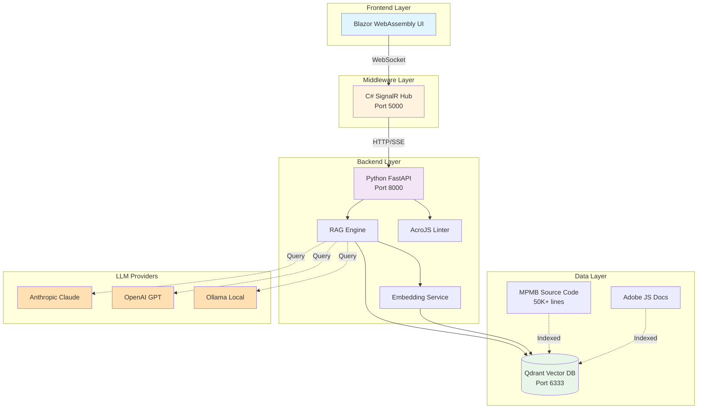
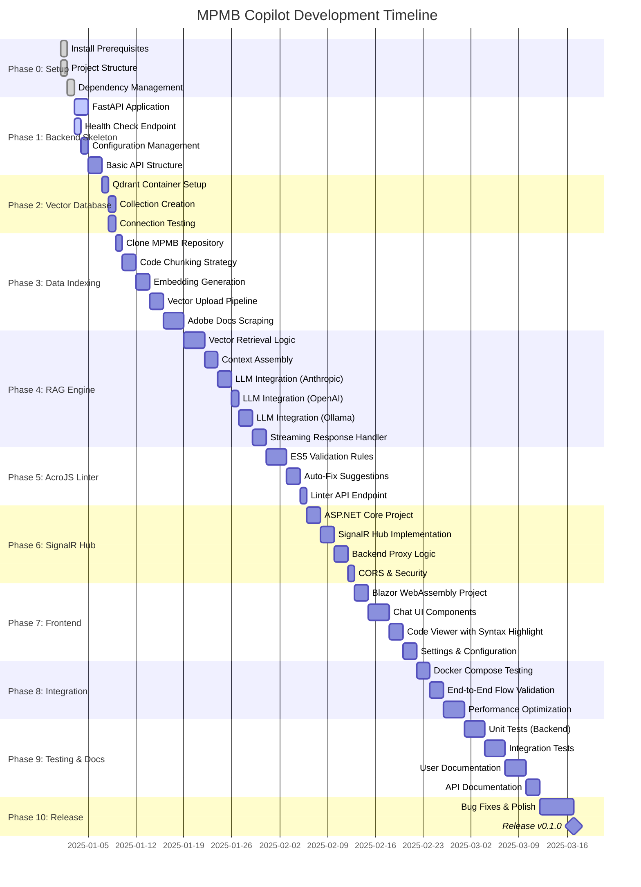

# MPMB Copilot

> **AI-Powered Development Assistant for MorePurpleMoreBetter's D&D 5e Character Record Sheet**

A Retrieval-Augmented Generation (RAG) system that helps developers write code for the MPMB Character Sheet framework using Adobe Acrobat JavaScript (ECMAScript 5).

---

## 🎯 Project Goals

### Primary Objective

Create an intelligent coding assistant that understands the MPMB character sheet codebase and can:

- Generate ECMAScript 5 compliant code for Adobe Acrobat JavaScript
- Provide accurate code examples for MPMB framework objects (SpellsList, MagicItemsList, etc.)
- Lint and validate AcroJS code against ES5 limitations
- Retrieve relevant code snippets from the 50,000+ line MPMB codebase
- Answer questions about MPMB framework patterns and best practices

### Key Features

- **Local-First**: Run entirely on your machine with Ollama (no API keys required)
- **Multi-Provider Support**: Works with Anthropic Claude, OpenAI GPT, or local Ollama models
- **RAG-Powered**: Vector search through indexed MPMB source code for relevant context
- **ES5 Enforcement**: Built-in linting to prevent modern JavaScript features not supported in Adobe Acrobat
- **Open Source**: Free to use, modify, and distribute

---

## 🏗️ Architecture



### Technology Stack

| Layer | Technology | Purpose |
| ------- | ----------- | --------- |
| **Frontend** | Blazor WebAssembly | Interactive chat interface |
| **Middleware** | ASP.NET Core + SignalR | Real-time bidirectional communication |
| **Backend** | Python + FastAPI | RAG engine, vector search, LLM integration |
| **Vector DB** | Qdrant | Semantic search over MPMB codebase |
| **Embeddings** | sentence-transformers | Convert code to vector representations |
| **LLM** | Claude/GPT/Ollama | Code generation and natural language understanding |
| **Linting** | Custom ES5 Validator | Enforce Adobe JavaScript compatibility |
| **Container** | Docker + Docker Compose | Consistent development environment |

---

## 📦 Current Status

### ✅ Completed

- [x] Project structure and directory layout
- [x] Python dependency management with `uv` and `pyproject.toml`
- [x] Docker configuration for all services
- [x] Multi-stage Dockerfile for optimized Python backend
- [x] ESLint configuration for ECMAScript 5 enforcement
- [x] Code formatting setup (Prettier, EditorConfig)
- [x] VSCode workspace configuration
- [x] `.gitignore` for Python, .NET, and Docker artifacts

### 🚧 In Progress

- [ ] FastAPI application skeleton
- [ ] Qdrant vector database setup
- [ ] MPMB source code indexing pipeline
- [ ] RAG engine core implementation

### 📋 Planned

- [ ] C# SignalR hub implementation
- [ ] Blazor WebAssembly frontend
- [ ] AcroJS linter rules engine
- [ ] Adobe JavaScript documentation scraper
- [ ] Comprehensive test suite
- [ ] Documentation and usage guides

---

## 🗺️ Development Roadmap



### Phase Descriptions

#### **Phase 0: Prerequisites** ✅ COMPLETE

- Install Python 3.11+, .NET 8.0, Docker Desktop, Git
- Install `uv` package manager
- Set up project directory structure
- Configure development environment

#### **Phase 1: Backend Skeleton** 🔄 IN PROGRESS

- Create FastAPI application with health check endpoint
- Implement configuration management with environment variables
- Set up API routing structure
- Add CORS middleware and basic error handling

#### **Phase 2: Vector Database**

- Start Qdrant container via Docker
- Create vector collection for MPMB code
- Verify connection and basic CRUD operations
- Set up collection schema with metadata

#### **Phase 3: Data Indexing**

- Clone MPMB GitHub repository
- Implement JavaScript code chunking algorithm
- Generate embeddings for code chunks
- Upload vectors to Qdrant with metadata
- Scrape and index Adobe JavaScript documentation

#### **Phase 4: RAG Engine**

- Build vector similarity search
- Implement context assembly from retrieved chunks
- Integrate Anthropic Claude API
- Integrate OpenAI GPT API
- Integrate Ollama for local LLM
- Add streaming response handling

#### **Phase 5: AcroJS Linter**

- Define ES5 compatibility rules
- Implement syntax validation
- Create auto-fix suggestion engine
- Add linter API endpoint

#### **Phase 6: SignalR Hub**

- Create ASP.NET Core SignalR project
- Implement ChatHub with message routing
- Add HTTP client to proxy requests to Python backend
- Configure CORS and security policies

#### **Phase 7: Frontend**

- Initialize Blazor WebAssembly project
- Build chat interface components
- Add code viewer with syntax highlighting
- Implement settings panel for API keys and model selection

#### **Phase 8: Integration**

- Test full stack with `docker-compose`
- Validate end-to-end message flow
- Optimize performance and response times
- Fix integration issues

#### **Phase 9: Testing & Documentation**

- Write unit tests for backend components
- Create integration test suite
- Write user documentation and tutorials
- Generate API documentation with FastAPI/Swagger

#### **Phase 10: Release**

- Bug fixes and final polish
- Performance testing and optimization
- Create release notes
- Publish v0.1.0

---

## 🚀 Quick Start

### Prerequisites

```bash
# Required
- Python 3.11+ (container uses 3.12)
- .NET 8.0 SDK
- Docker Desktop
- Git
- uv package manager

# Optional (for local LLM)
- Ollama
```

### Installation

1. **Clone the repository**

   ```bash
   git clone <repository-url>
   cd mpmb-copilot
   ```

2. **Set up environment variables**

   ```bash
   cp .env.example .env
   # Edit .env with your API keys (if using cloud LLMs)
   ```

3. **Install backend dependencies**

   ```bash
   cd backend
   uv venv
   source .venv/bin/activate  # Windows: .venv\Scripts\activate
   uv sync
   ```

4. **Start services with Docker**

   ```bash
   cd ..
   docker-compose up -d
   ```

5. **Verify services**

   ```bash
   # Backend health check
   curl http://localhost:8000/api/health
   
   # Qdrant dashboard
   open http://localhost:6333/dashboard
   
   # SignalR hub (once implemented)
   curl http://localhost:5000
   
   # Frontend (once implemented)
   open http://localhost:3000
   ```

### Development Workflow

```bash
# Backend development (with hot reload)
cd backend
uv run uvicorn app.main:app --reload

# Run tests
uv run pytest tests/ -v

# Format code
uv run black app/
uv run ruff check app/

# Build Docker images
docker-compose build

# View logs
docker-compose logs -f backend
```

---

## 📁 Project Structure

```txt
mpmb-copilot/
├── .editorconfig                 # Editor configuration
├── .gitignore                    # Git ignore rules
├── .prettierrc                   # JavaScript formatting
├── docker-compose.yml            # Multi-service orchestration
├── .env.example                  # Environment variables template
├── README.md                     # This file
│
├── backend/                      # Python FastAPI backend
│   ├── .python-version          # Python 3.13 for local dev
│   ├── Dockerfile               # Multi-stage build (uses Python 3.12)
│   ├── pyproject.toml           # Project dependencies
│   ├── uv.lock                  # Locked dependencies
│   ├── app/
│   │   ├── __init__.py
│   │   ├── main.py              # FastAPI application
│   │   ├── config.py            # Configuration
│   │   ├── api/                 # API endpoints
│   │   │   ├── chat.py
│   │   │   ├── index.py
│   │   │   └── health.py
│   │   ├── core/                # Business logic
│   │   │   ├── rag_engine.py
│   │   │   ├── embeddings.py
│   │   │   ├── chunker.py
│   │   │   └── retriever.py
│   │   ├── linter/              # AcroJS validation
│   │   │   ├── acrojs_linter.py
│   │   │   ├── rules.py
│   │   │   └── fixes.py
│   │   ├── models/              # Pydantic models
│   │   └── services/            # External services
│   └── tests/                   # Test suite
│
├── hub/                          # C# SignalR Hub
│   ├── Dockerfile
│   ├── MPMBCopilotHub.csproj
│   ├── Program.cs
│   ├── Hubs/
│   │   └── ChatHub.cs
│   └── Services/
│       └── RagApiService.cs
│
├── frontend/                     # Blazor WebAssembly
│   ├── Dockerfile
│   ├── MPMBCopilotUI.csproj
│   ├── Pages/
│   │   ├── Chat.razor
│   │   ├── Settings.razor
│   │   └── CodeViewer.razor
│   └── wwwroot/
│
├── data/                         # Data files (gitignored)
│   ├── mpmb_source/             # MPMB repository clone
│   ├── adobe_docs/              # Adobe JS documentation
│   └── index_cache/             # Cached embeddings
│
├── docs/                         # Documentation
│   ├── BUILD_ORDER.md           # Step-by-step build guide
│   ├── SETUP_CHECKLIST.md       # Setup verification
│   └── ARCHITECTURE.md          # Detailed architecture
│
├── .vscode/                      # VSCode settings
│   └── settings.json
│
└── eslint.config.mjs            # ES5 linting rules (for reference)
```

---

## 🔧 Configuration

### Environment Variables

Create a `.env` file in the project root:

```bash
# LLM Provider (choose one or multiple)
ANTHROPIC_API_KEY=sk-ant-xxxxx
OPENAI_API_KEY=sk-xxxxx
OLLAMA_HOST=http://localhost:11434

# Default provider: "anthropic", "openai", or "ollama"
DEFAULT_LLM_PROVIDER=anthropic
DEFAULT_MODEL=claude-sonnet-4-20250514

# Vector Database
QDRANT_HOST=localhost
QDRANT_PORT=6333
QDRANT_COLLECTION=mpmb_code

# Embedding Settings
EMBEDDING_PROVIDER=sentence-transformers
EMBEDDING_MODEL=all-MiniLM-L6-v2
EMBEDDING_DIMENSION=384

# RAG Parameters
CHUNK_SIZE=1000
CHUNK_OVERLAP=200
TOP_K_RESULTS=5
SIMILARITY_THRESHOLD=0.7

# Application
ENVIRONMENT=development
LOG_LEVEL=INFO
MAX_TOKENS=4000
TEMPERATURE=0.2
```

### Docker Compose Services

| Service | Port | Description |
| --------- | ------ | ------------- |
| `qdrant` | 6333, 6334 | Vector database for code embeddings |
| `backend` | 8000 | Python FastAPI RAG engine |
| `hub` | 5000 | C# SignalR hub (middleware) |
| `frontend` | 3000 | Blazor WebAssembly UI |

---

## 🧪 Testing

### Backend Tests

```bash
cd backend
uv run pytest tests/ -v --cov=app
```

### Integration Tests

```bash
# Start all services
docker-compose up -d

# Run integration tests
cd backend
uv run pytest tests/integration/ -v
```

### Manual Testing

```bash
# Test RAG endpoint (once implemented)
curl -X POST http://localhost:8000/api/chat/stream \
  -H "Content-Type: application/json" \
  -d '{"message": "How do I add a spell to SpellsList?"}'
```

---

## 🤝 Contributing

This is an open-source project! Contributions are welcome.

### Development Setup

1. Fork the repository
2. Create a feature branch: `git checkout -b feature/amazing-feature`
3. Commit your changes: `git commit -m 'Add amazing feature'`
4. Push to the branch: `git push origin feature/amazing-feature`
5. Open a Pull Request

### Code Standards

- **Python**: Follow PEP 8, use `black` and `ruff` for formatting/linting
- **C#**: Follow .NET coding conventions
- **JavaScript**: ECMAScript 5 only (enforced by ESLint)
- **Commits**: Use conventional commit messages

---

## 📚 Key Concepts

### Why ECMAScript 5?

Adobe Acrobat JavaScript uses an **ES5-based engine** with proprietary extensions. Modern JavaScript features (arrow functions, `const`, `let`, template literals, etc.) will cause runtime errors in PDFs. This project enforces ES5 compatibility through linting and provides AI-generated code that works correctly in Adobe's environment.

### What is MPMB?

[MorePurpleMoreBetter's Character Record Sheet](https://github.com/morepurplemorebetter/MPMBs-Character-Record-Sheet) is a comprehensive automated character sheet for D&D 5e. It uses Adobe Acrobat JavaScript to calculate stats, manage spells, handle multiclassing, and automate complex character features. The codebase is **76,000+ lines** across multiple files.

### How RAG Works Here

1. **Indexing**: MPMB source code is chunked and converted to vector embeddings
2. **Retrieval**: User queries are embedded and similar code chunks are retrieved
3. **Augmentation**: Retrieved code is added as context to the LLM prompt
4. **Generation**: LLM generates ES5-compliant code based on retrieved examples

---

## 🎓 Learning Resources

### MPMB Framework

- [MPMB GitHub Repository](https://github.com/morepurplemorebetter/MPMBs-Character-Record-Sheet)
- [MPMB Syntax Documentation](https://github.com/morepurplemorebetter/MPMBs-Character-Record-Sheet/tree/master/additional%20content%20syntax)

### Adobe Acrobat JavaScript

- [Adobe JavaScript Reference](https://opensource.adobe.com/dc-acrobat-sdk-docs/acrobatsdk/documentation.html)
- [JavaScript for Acrobat API Reference](https://opensource.adobe.com/dc-acrobat-sdk-docs/acrobatsdk/documentation/JavaScriptCoverage.html)

### RAG & LLMs

- [LangChain Documentation](https://python.langchain.com/docs/get_started/introduction)
- [Qdrant Documentation](https://qdrant.tech/documentation/)
- [Anthropic Claude API](https://docs.anthropic.com/claude/reference/getting-started-with-the-api)

---

## 📝 License

This project is licensed under the MIT License - see the [LICENSE](LICENSE) file for details.

---

## 🙏 Acknowledgments

- **MorePurpleMoreBetter** for creating and maintaining the MPMB Character Record Sheet
- **Anthropic** for Claude API
- **Qdrant** for the vector database
- **FastAPI** and **ASP.NET Core** communities

---

## 📧 Contact

- **Issues**: Please use GitHub Issues for bug reports and feature requests
- **Discussions**: Use GitHub Discussions for questions and general discussion

---

## 🚦 Project Status

**Current Phase**: Phase 1 - Backend Skeleton (In Progress)

**Next Milestone**: Complete FastAPI skeleton with health check endpoint

**Estimated v0.1.0 Release**: March 2025

---

## 💡 Usage as AI Prompt

When using this README as context for AI assistants (Claude, ChatGPT, etc.):

```txt
I'm working on the MPMB Copilot project. Here's the README with full context:
[paste this README]

Current task: [describe what you're working on]
Current phase: [reference the phase from the roadmap]
Question: [your specific question]
```

This README provides:

- ✅ Full project context and goals
- ✅ Current implementation status
- ✅ Technology stack and architecture
- ✅ Directory structure and conventions
- ✅ Development roadmap with phases
- ✅ Configuration and setup instructions

Use this as the single source of truth for project understanding.
