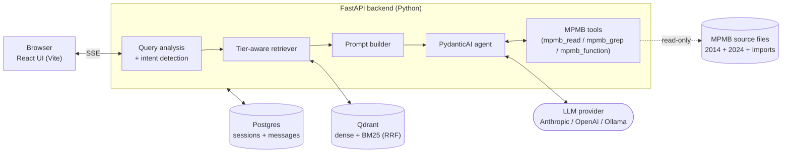

# MPMB-Copilot

> **AI assistant that helps you write MPMB JS scripts using the actual MPMB source code and examples as ground truth.**
> ⚠️ **Pre-release.** This is a working prototype, not a polished product. Setup involves several moving parts (Docker, an LLM API key, indexing) and the UX still has rough edges. If you're a D&D player who just wants AI help writing MPMB scripts, expect a bumpy ride for now — feedback welcome.

<!-- TODO: add screenshot of chat UI showing a tool-use response with the "Used 2 tools" footer expanded -->

## What it does

MPMB-Copilot is a chat interface, like ChatGPT or Claude, but specialized for [MorePurpleMoreBetter's D&D 5e Character Record Sheet](https://github.com/morepurplemorebetter/MPMBs-Character-Record-Sheet). When you ask a question, it:

1. Searches the actual MPMB source code (8,700+ chunks across 2014 + 2024 editions plus the WotC Imports repo)
2. Retrieves the most relevant code snippets, syntax templates, and examples
3. Sends them as context to Claude (Anthropic), GPT (OpenAI), or a local Ollama model
4. Streams the answer back, with citations, so you can copy-paste working code

It also has **tool use**: the model can read specific files, search by pattern, or look up a specific function's body when it needs to verify an exact signature instead of guessing. You'll see a "🔍 Verifying code…" indicator when it does, and a "Used N tools" footer below the answer.

## Who this is for

- **Homebrew authors** who want to add a new race, subclass, spell, or magic item to MPMB and need help with the syntax
- **MPMB contributors** who maintain the source and want a fast way to look up obscure attributes or trace call sites
- **Curious tinkerers** who want to understand how MPMB works under the hood

You don't need to be a programmer, but you do need to be comfortable installing Docker and editing a config file once. After that, it's just a chat window.

## What you'll need

- **An LLM API key.** Anthropic Claude is the default and works best (the system prompt is tuned for it). OpenAI and Ollama also work. You pay the LLM provider directly for tokens — this project doesn't host anything.
- **Docker Desktop** (Windows/macOS) or Docker Engine (Linux) — for Postgres and the vector database.
- **Node.js 24+** and **Python 3.13+** — for running the chunker, the backend, and the web UI.
- **`uv`** — Python package manager. [Install instructions](https://docs.astral.sh/uv/getting-started/installation/).
- **About 5 GB of disk** for the chunked source files, vector index, and Docker images.

## Quick start

```bash
# 1. Clone this repo and the MPMB sources it indexes
git clone https://github.com/track507/MPMB-Copilot.git
cd MPMB-Copilot
npm install

# 2. Add your API key
cp .env.example .env
# edit .env, set ANTHROPIC_API_KEY (or OPENAI_API_KEY)

# 3. One-shot setup: clones MPMB sources, chunks them, starts Postgres+Qdrant, indexes
npm run setup:all

# 4. Run the dev servers (frontend + backend)
npm run dev
```

Open <http://localhost:5173/> and start chatting.

The first time you start the backend it will take ~30 seconds to load the embedding model. After that, responses stream in a few seconds.

## Updating the MPMB sources

MPMB ships updates frequently. To pull the latest source, re-chunk, and re-index:

```bash
npm run setup     # git pull on the source repos + re-run the chunker
npm run index     # rebuild the vector index (backend must be running)
```

## How it's built



- **Frontend:** React 19 + Vite + TanStack Query + Zustand + shadcn/ui
- **Backend:** FastAPI + PydanticAI + SQLAlchemy
- **Vector store:** Qdrant (hybrid retrieval: dense embeddings via FastEmbed + BM25 sparse, fused with RRF)
- **Database:** Postgres (session and message persistence)
- **LLM providers:** Anthropic, OpenAI, Ollama (configurable)

For the deeper architecture write-up, see [`docs/superpowers/specs/2026-04-18-phase-b-tool-use-design.md`](./docs/superpowers/specs/2026-04-18-phase-b-tool-use-design.md).

## Repository layout

```
MPMB-Copilot/
├── backend/                  # FastAPI app — see backend/README.md
├── frontend/                 # React app    — see frontend/README.md
├── data/                     # gitignored: cloned MPMB sources, chunks, index cache
├── docker/                   # Dockerfiles for backend + custom postgres image
├── docker-compose.yml        # postgres + qdrant + backend
├── docs/                     # specs, plans, policy docs
├── scripts/
│   ├── setup.ps1             # clone/pull MPMB source repos, run chunker
│   ├── chunk_mpmb.py         # chunk MPMB JS into JSON files for indexing
│   ├── index.mjs             # trigger /api/index against running backend
│   ├── check-port.mjs        # pre-flight check before uvicorn
│   └── wait-and-index.mjs    # used by setup:all — poll backend then index
├── package.json              # all dev commands
└── README.md                 # you are here
```

## Common commands

```bash
# First-time setup
npm run setup              # clone/update MPMB source repos + chunk
npm run setup:docker       # build & start postgres + qdrant + backend containers
npm run setup:index        # wait for backend health then index Qdrant
npm run setup:all          # all three above, in order

# Day-to-day
npm run dev                # frontend + backend in parallel (recommended)
npm run dev:backend        # backend only (FastAPI on :8000)
npm run dev:frontend       # frontend only (Vite on :5173)
npm run docker:up          # start postgres + qdrant
npm run docker:down        # stop containers

# Refreshing content
npm run chunk              # re-chunk after pulling MPMB sources
npm run index              # re-upsert chunks into Qdrant
npm run index:if-empty     # only index if Qdrant collection is empty

# Quality gates
npm run check              # lint + format check + tests
npm run check:full         # also runs mypy + tsc
```

## Features

- ✅ **Hybrid retrieval** — dense embeddings (BAAI/bge-small-en-v1.5) + BM25 sparse, RRF-fused for relevance even on rare identifier names
- ✅ **Tier-aware ranking** — authoritative sources (`_functions/`, `_variables/`, `additional content syntax/`) score above community examples
- ✅ **Edition-aware** — auto-detects whether your question is about 2014 or 2024 rules and filters accordingly
- ✅ **Tool use** — the model can read specific files, grep across the source, or fetch a function's body when it needs verbatim code
- ✅ **Streaming** — Server-Sent Events stream tokens as they generate, with intermediate tool-use indicators
- ✅ **Session persistence** — every conversation is saved to Postgres and resumes on refresh
- ✅ **Auto-titled sessions** — first message generates a 4-6 word title (like Claude web)
- ✅ **Source citations** — every answer attaches the file paths it pulled from

## What's next

Phase B (read-only tool use) is shipped. Future work:

- **Phase C** — write tools that can apply edits or generate diff patches against MPMB source files
- **Phase D** — upload API for user-supplied source bundles (e.g. private homebrew collections)
- **Phase E** — adaptive thinking + auto-tuned tool-call limits per query type
- **Polish** — improved retriever speed, richer source UI, in-chat code execution sandbox

## Troubleshooting

**Backend won't start / port 8000 is busy.**
A previous backend process is still alive. On Windows:

```powershell
Get-Process python, pythonw -ErrorAction SilentlyContinue | Stop-Process -Force
```

**Page refresh takes 30+ seconds.**
You're hitting the IPv6 fallback timeout. Make sure your `.env` uses `127.0.0.1` (not `localhost`) for `POSTGRES_HOST` and `QDRANT_HOST`.

**`npm run index` says "Backend is not reachable".**
Backend isn't running. Start it with `npm run dev` (recommended) or `npm run docker:up && npm run setup:index`.

**Qdrant container is unhealthy in `docker compose ps`.**
On Windows this is a known false positive — Qdrant is responsive but its healthcheck script can't run. Confirm with `curl http://127.0.0.1:6333/`.

**Postgres password mismatch after `docker compose up`.**
Postgres only honors `POSTGRES_PASSWORD` on first volume init. If your `.env` password no longer matches what the volume was initialized with, either reset (destructive: `docker volume rm mpmb_postgres_data`) or `ALTER USER mpmb_user WITH PASSWORD '...'` inside the container.

## License

Apache License 2.0 — see [`LICENSE`](./LICENSE).

This repo distributes **code only**. The MPMB source files in `data/mpmb_source/` and `data/mpmb_source_2024/` are cloned at setup time from [MorePurpleMoreBetter's repository](https://github.com/morepurplemorebetter/MPMBs-Character-Record-Sheet) and are subject to MPMB's own licensing.

See [`docs/CUSTOM_DOCS_POLICY.md`](./docs/CUSTOM_DOCS_POLICY.md) and [`docs/TERMS_OF_USE.md`](./docs/TERMS_OF_USE.md) for content policies.
