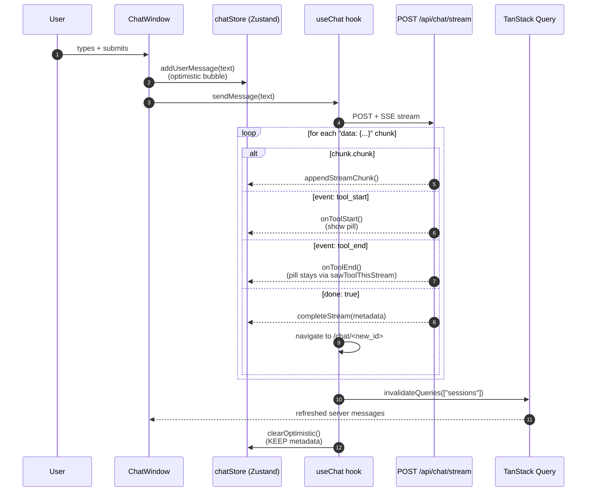

# Frontend

React web app for chatting with MPMB-Copilot.

> See the [root README](../README.md) for the user-facing pitch and quick start. This document is for working *inside* `frontend/`.

## Stack

- **React 19** + **TypeScript 6** (strict; `strict: true` is the TS 6 default)
- **React Compiler** — auto-memoizes components at build time via the official preset, run through `@rolldown/plugin-babel`
- **Vite 8** (rolldown) — dev server, HMR, build
- **TanStack Router** — code-defined route tree with guarded route groups (see [Routing](#routing))
- **TanStack Query v5** — server-state cache (sessions, messages, settings, uploads, auth)
- **TanStack Virtual** — chat history virtualization
- **Zustand** — transient client state (streaming buffer, optimistic UI, tool indicators, staged uploads)
- **react-hook-form** + **zod** — forms and validation
- **shadcn/ui** (vendored under `components/ui/`) + **radix-ui** + **Tailwind CSS v4** — primitives + styling
- **Temporal** (`temporal-polyfill/global`, imported in `main.tsx`) — never `Date`
- **react-markdown** + **remark-gfm** — message rendering with code blocks and tables
- **lucide-react** — icons; **sonner** — toasts

Tailwind v4 is CSS-first: it is configured through `@tailwindcss/vite` and `index.css`. There is no `tailwind.config.ts`.

## Layout

```
frontend/
├── src/
│   ├── main.tsx                # entry — Temporal polyfill + renders <App/>
│   ├── App.tsx                 # QueryClientProvider + RouterProvider + devtools
│   ├── router.tsx              # the route tree, guards, and staticData titles
│   ├── routes/guards.ts        # requireAuth / requireAdmin (beforeLoad)
│   ├── components/
│   │   ├── chat/               # chat-window, message-bubble, message-actions,
│   │   │                       # attachment-chips, code-block
│   │   ├── layout/             # root-layout, admin-layout, sidebar-nav, top-bar
│   │   ├── settings/           # settings panel + capability pickers
│   │   └── ui/                 # vendored shadcn primitives (exempt from several lint rules)
│   ├── hooks/                  # use-chat, use-sessions, use-settings, use-auth,
│   │                           # use-feedback, use-smooth-text
│   ├── stores/                 # chat-store, upload-store (Zustand)
│   ├── lib/
│   │   ├── http/               # core (RFC 9457 ApiError), api-client, chat-stream, upload-client
│   │   ├── uploads.ts          # upload queries/mutations
│   │   ├── index-actions.ts    # reindex triggers
│   │   ├── query-client.ts     # shared QueryClient (401 -> invalidate auth state)
│   │   └── utils.ts            # cn() helper
│   ├── pages/                  # home, login, setup, library, account, settings, not-found
│   ├── types/                  # mirrors backend schemas (snake_case field names)
│   └── index.css               # Tailwind entry + theme tokens
├── test/                       # vitest suites, mirroring src/
├── eslint.config.mjs
├── vite.config.ts              # proxy /api → 127.0.0.1:8000, path aliases, React Compiler
└── tsconfig.json
```

## Routing

Routes are defined programmatically in `router.tsx` (not file-based) and all page components are `lazy()`-loaded. The hierarchy:

- `rootRoute` — bare outlet, owns the 404 page
  - `/login`, `/setup` — unauthenticated
  - a **pathless** auth layout whose `beforeLoad` runs `requireAuth` and whose component is `RootLayout` (sidebar + top bar)
    - `/`, `/chat/$sessionId`, `/library`, `/account`
    - `/admin` — its own `requireAdmin` guard and `AdminLayout` shell

Guards live in `routes/guards.ts` and `throw redirect(...)` / `throw notFound()`. A non-admin hitting `/admin` gets the **404 page in place**, not a redirect — the route's existence is deliberately not discoverable.

Each route can declare `staticData: { title, description, chat }`. The top bar renders the deepest match's title/description; routes flagged `chat: true` show the live session title and the index-status pill instead.

## Running

The frontend normally launches via the root `pnpm run dev` (concurrent with the backend). Standalone:

```bash
# from repo root
pnpm run dev:frontend

# or directly
cd frontend && pnpm run dev
```

Dev server runs at <http://localhost:5173/>. Vite proxies `/api/*` → `http://127.0.0.1:8000` so there's no CORS to worry about.

## Build

```bash
pnpm run build              # production build → frontend/dist/
pnpm run preview            # serve the built bundle locally
pnpm run typecheck          # tsc --noEmit (also runs as part of root pnpm run check:full)
```

There is **no production Dockerfile yet** for the frontend — the published-image story is not implemented. For now, run dev locally or build static assets and serve them however you like.

## Transport — never call `fetch` directly

Every request goes through `lib/http`. No page, component, or hook issues a raw `fetch`, `XMLHttpRequest`, or `EventSource`.

- `core.ts` — the shared `request()` wrapper, the RFC 9457 `ProblemDetail` shape, and the `ApiError` class every failure becomes.
- `api-client.ts` — typed `get/post/put/patch/delete`.
- `chat-stream.ts` — `streamChat()`, which POSTs to `/api/chat/stream` and parses the SSE frames.
- `upload-client.ts` — `uploadFile()` over `XMLHttpRequest`, because `fetch` has no reliable upload-progress event.

A 401 anywhere invalidates the auth-state query, which bounces the route guards to `/login`.

## State model

Two stores, deliberately split:

**TanStack Query (server state):** sessions, messages, settings, capabilities, index status, uploads, auth state, feedback. Fetched, cached, and invalidated on mutations.

**Zustand (transient client state):**

- `chat-store.ts` — `pendingUserMessage` (optimistic bubble), `streamedText`, `isStreaming`, `metadata` (final-chunk metadata kept alive so the "Used N tools" footer survives the refetch gap), and the tool-pill signals.
- `upload-store.ts` — staged attachments with per-file status/progress/error, plus client-side mirrors of the backend's extension/size/count policy.

The split keeps fast-changing streaming state out of TanStack's cache. Neither store persists; server state is the source of truth on reload.

## Streaming flow



Streamed tokens are revealed through `use-smooth-text`, which throttles on `requestAnimationFrame` so network bursts read as steady typing. History is virtualized (`TanStack Virtual`, dynamic measurement, low overscan); the in-flight rows render un-virtualized below it. `MessageBubble` is explicitly `memo()`-wrapped because React Compiler bails on `ChatWindow` (it cannot memoize the virtualizer's returned functions).

## Testing

Vitest + Testing Library, jsdom. Suites live in `frontend/test/`, mirroring `src/`.

```bash
pnpm run test
```

New components and hooks ship with tests. Mock at the module boundary (`@/hooks/*`, `@/lib/http`) rather than stubbing `fetch`/XHR — except in `test/lib/http/*`, which tests the transport itself. `vi.mock` factories are hoisted, so anything they reference must come from `vi.hoisted()`.

## Path aliases

`@/` → `frontend/src/`. Configured in both `vite.config.ts` and `tsconfig.json`.

## Linting / formatting

ESLint flat config in `eslint.config.mjs` (`strictTypeChecked` + `stylisticTypeChecked`). Prettier handles formatting. Both run via the root `lint-staged` hook on commit.

```bash
pnpm run lint               # eslint --config frontend/eslint.config.mjs
pnpm run typecheck          # tsc --noEmit
```

Rules worth knowing before your first PR:

- Explicit return types are required on functions and module boundaries.
- `exactOptionalPropertyTypes` is on — optional fields are written `readonly x?: T | undefined`, and conditional properties use the object-spread pattern.
- `strict-boolean-expressions` and `no-unnecessary-condition` are errors, hence the explicit `!== null` / `!== undefined` checks everywhere. `no-non-null-assertion` means `!` is never used.
- Type-only imports must be separate `import type { ... }` statements.
- `no-console` is an error in `.ts`, a warning in `.tsx`.
- `snake_case` is permitted **only** for property names, because the types mirror backend JSON field names.
- `components/ui/**` is vendored shadcn and exempt from naming/return-type rules — don't restyle it to match the rest of the app.

## Common gotchas

- **`localhost` proxy fails on Windows.** Vite's proxy target is pinned to `http://127.0.0.1:8000` in `vite.config.ts` to avoid Node's IPv6 happy-eyeballs timeout. Don't change it back to `localhost`.
- **HMR doesn't pick up new `.env` values.** Frontend `.env` (if you add one) is read at Vite startup; restart `pnpm run dev:frontend` after edits.
- **TanStack devtools** (Query and Router) are mounted in `App.tsx` in dev mode — use them to inspect cache and route state.
- **Zustand stores don't persist.** State is fully transient; resets on reload. Server state is the source of truth.
- **Use Temporal, not `Date`.** `Temporal.Now.instant()` for anything stored or sent; convert to the viewer's zone only for display.
