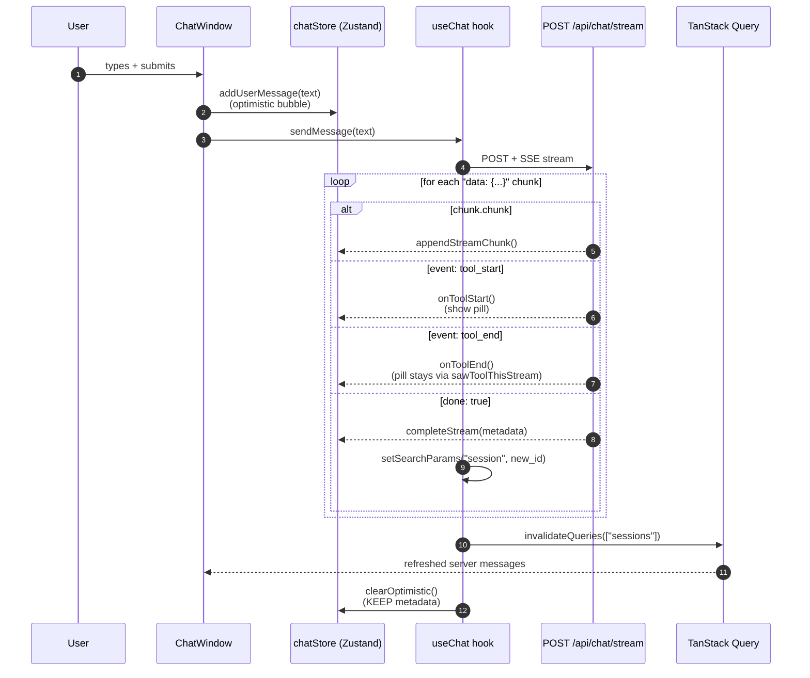

# Frontend

React web app for chatting with MPMB-Copilot.

> See the [root README](../README.md) for the user-facing pitch and quick start. This document is for working *inside* `frontend/`.

## Stack

- **React 19** + **TypeScript** (strict)
- **Vite 8** — dev server, HMR, build
- **TanStack Query v5** — server-state cache (sessions, messages, settings)
- **Zustand** — transient client state (streaming buffer, optimistic UI, tool indicators)
- **shadcn/ui** + **Tailwind CSS v4** — component primitives + styling
- **react-router** — client-side routing (single page with `?session=<uuid>` param)
- **react-markdown** + **remark-gfm** — message rendering with code blocks and tables
- **lucide-react** — icons
- **sonner** — toast notifications

## Layout

```
frontend/
├── src/
│   ├── main.tsx                # entry — sets up QueryClient, Router, Theme
│   ├── App.tsx                 # top-level routes
│   ├── components/
│   │   ├── chat/
│   │   │   ├── chat-window.tsx     # main chat surface — streaming bubbles + input
│   │   │   ├── message-bubble.tsx  # one user/assistant message + tools footer + sources
│   │   │   ├── code-block.tsx      # syntax-highlighted code with copy button
│   │   │   └── source-citation.tsx # collapsible per-source list
│   │   ├── layout/
│   │   │   ├── root-layout.tsx     # sidebar + topbar wrapper
│   │   │   ├── sidebar-nav.tsx     # session list + new-chat button
│   │   │   └── top-bar.tsx         # index-status pill, settings button
│   │   └── ui/                     # shadcn primitives
│   ├── hooks/
│   │   ├── use-chat.ts             # POST /api/chat/stream + SSE parser + URL persistence
│   │   ├── use-sessions.ts         # TanStack queries/mutations for sessions
│   │   └── use-settings.ts         # behavioral settings via /api/settings
│   ├── stores/
│   │   └── chat-store.ts           # Zustand store: pending msg, streamed text, tool latch, metadata
│   ├── types/
│   │   ├── chat.ts                 # mirrors backend ChatRequest/ChatStreamChunk schemas
│   │   └── session.ts              # mirrors backend SessionDetail/Message schemas
│   ├── lib/
│   │   ├── api-client.ts           # fetch wrapper, JSON parsing, error normalization
│   │   └── utils.ts                # cn() helper for Tailwind
│   └── index.css                   # Tailwind entry + theme tokens
├── public/
├── eslint.config.mjs
├── vite.config.ts                  # proxy /api → 127.0.0.1:8000, path aliases
├── tailwind.config.ts
└── tsconfig.json
```

## Running

The frontend normally launches via the root `pnpm run dev` (concurrent with the backend). Standalone:

```bash
# from repo root
pnpm run dev:frontend

# or directly
cd frontend && pnpm run dev
```

Dev server runs at <http://localhost:5173/>. Vite proxies `/api/*` → `http://127.0.0.1:8000` so there's no CORS to worry about.

## Build

```bash
pnpm run build              # production build → frontend/dist/
pnpm run preview            # serve the built bundle locally
pnpm run typecheck          # tsc --noEmit (also runs as part of root pnpm run check:full)
```

There is **no production Dockerfile yet** for the frontend — the published-image story is not implemented. For now, run dev locally or build static assets and serve them however you like.

## State model

Two stores, deliberately split:

**TanStack Query (server state):** `sessions`, `messages` per session, `settings`, `index status`. These are fetched, cached, and invalidated on mutations. See `hooks/use-sessions.ts`.

**Zustand (transient client state):** `chat-store.ts`. Lives only in memory, holds:

- `pendingUserMessage` — optimistic user bubble shown while server hasn't echoed it back yet
- `streamedText` — assistant tokens accumulated during streaming
- `isStreaming` — gate flag
- `metadata` — final-chunk metadata (session_id, tools, timing) needed before server refetch lands
- `activeToolCount`, `sawToolThisStream` — tool-pill rendering signals

The split avoids putting fast-changing streaming state into TanStack's cache (which would trigger excessive React rerenders and be wrong about who owns the data).

## Streaming flow



`completeStream` keeps `metadata` in the store so the "Used N tools" footer survives the brief gap before the server refetch arrives. Once the server message lands, `MessageBubble` reads `meta_data.tools` directly from the persisted message, so the footer survives page reloads too.

## Path aliases

`@/` → `frontend/src/`. Configured in both `vite.config.ts` and `tsconfig.json`.

## Linting / formatting

ESLint flat config in `eslint.config.mjs` (extends from the shared root config). Prettier handles formatting. Both run via the root `lint-staged` hook on commit.

```bash
pnpm run lint               # frontend lint via root config (eslint --config frontend/eslint.config.mjs)
pnpm run typecheck          # tsc --noEmit
```

## Common gotchas

- **`localhost` proxy fails on Windows.** Vite's proxy target is pinned to `http://127.0.0.1:8000` in `vite.config.ts` to avoid Node's IPv6 happy-eyeballs timeout. Don't change it back to `localhost`.
- **HMR doesn't pick up new `.env` values.** Frontend `.env` (if you add one) is read at Vite startup; restart `pnpm run dev:frontend` after edits.
- **TanStack devtools** are mounted in `main.tsx` in dev mode — use them to inspect cache state when something looks wrong.
- **Zustand store doesn't persist.** State is fully transient; resets on page reload. Server state is the source of truth — TanStack refetches handle reload correctness.
